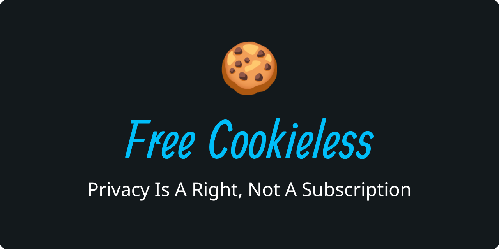

Free Cookieless provides Pi-hole compatible blocklists targeting websites that use **Dark Patterns** and
**"Pay-or-Consent"** models to circumvent user privacy. We believe that exercising your data rights should be free,
simple, and immediate.

> **GDPR Recital 42**
>
> [...]
> Consent should not be regarded as freely given if the data subject has no genuine or free choice or is unable to
> refuse or withdraw consent without detriment.

We block services that violate this principle by employing:

* **Cookie Paywalls ("Consent or Pay"):** Forcing users to pay a subscription to exercise their right to refuse
  tracking.
* **Deceptive Design (Dark Patterns):** Hiding the "Reject" option behind obscured text, complex sub-menus, or deceptive
  interface layouts.
* **Friction by Design:** Forcing users to manually toggle dozens of "legitimate interest" or 3rd-party vendors
  one-by-one, while offering a single-click "Accept All" button.

## Join the Fight: How to Contribute

Privacy is a collective effort. If you encounter a website that hides its "Reject" button, forces a subscription to
avoid tracking, or makes privacy a maze, we want to hear about it.

### How you can help:

1. **Report a Website:** Encountered a "Pay-or-Consent" wall or a dark pattern? [Open an issue][1] with the URL and a
   brief description of the non-compliant behavior.
2. **Submit a Pull Request:** If you are comfortable with Git, you can directly suggest additions to the list. Please
   ensure the domain is correctly categorized.
3. **Spread the Word:** Help others regain their "freely given" choice by sharing this project.

**Criteria for inclusion:**
We don't block websites for having ads; we block them for **obstructing the legal right to refuse tracking.** If a site
makes it "detrimental" or "difficult" to say no, it belongs on this list.

## Redemption & Appeals

We believe in a web where privacy is the default. If a website listed here has updated its practices to be compliant
with GDPR Recital 42 and EDPB guidelines, we are happy to remove it.

### The Redemption Process

1. **Apply for Review:** Website owners may [open an Appeal Issue][2] documenting the changes made (e.g., adding a
   visible "Reject All" button at the same level as "Accept All," or removing a "Pay-to-Reject" wall).
2. **Manual Verification:** Our maintainers will manually verify the site.
3. **Redemption:** If the site is found compliant, it will be removed from the blocklist and added to
   our [Redemption List](./redemption.md); a public log of websites that have improved their privacy standards.

### The "Hall of Shame" (Zero-Tolerance Policy)

We value the trust of our users. If a website is removed via the Redemption process but later **reintroduces** dark
patterns or pay-or-consent models:

* The domain will be **permanently re-added** to the blocklist.
* The domain will be moved to the [Hall Of Shame](./hall_of_shame.md).
* **No further appeals will be considered.**

We consider the reintroduction of these patterns as a "bad faith" attempt to circumvent community blocklists.

[1]: https://github.com/alexpado/free-cookieless/issues/new?template=report-a-non-compliant-website.md

[2]: https://github.com/alexpado/free-cookieless/issues/new?template=website-appeal--removal-request-.md